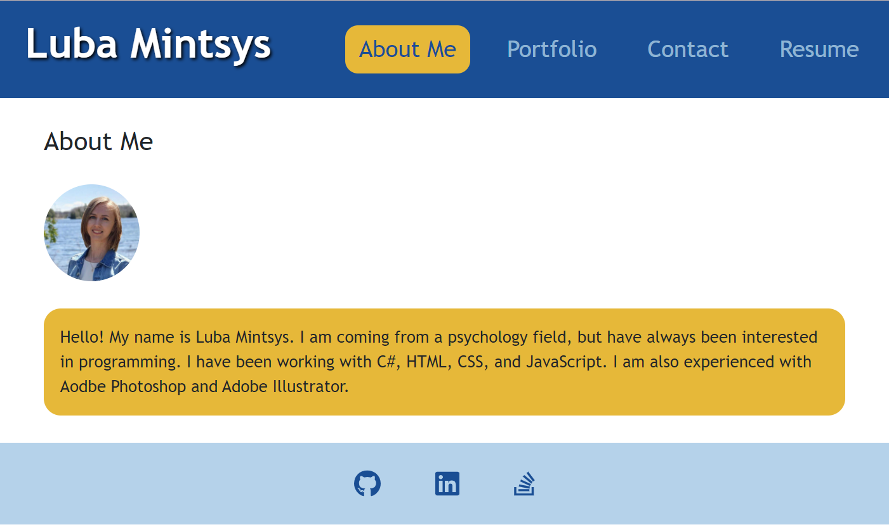
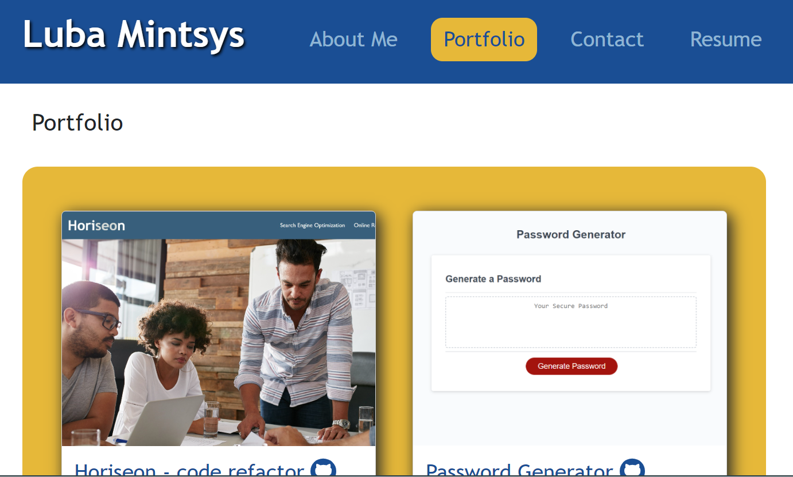
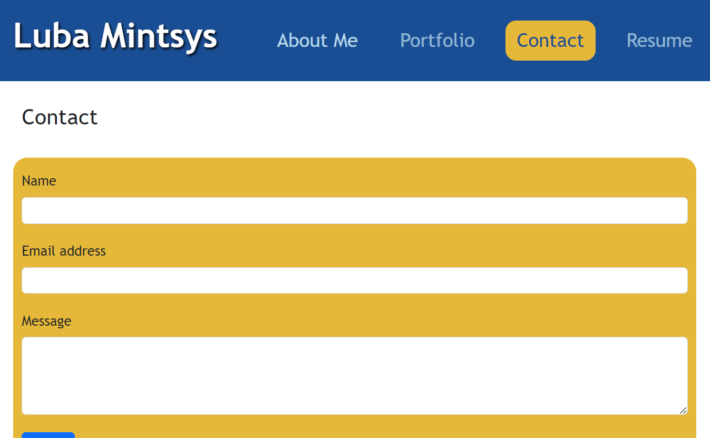

# React Portfolio

## Description

The aim of this project was to build a single-page portfolio app using React.js. In this portfolio a user can showcase their work, share info about themselves as well as their resume. In addition, other users may leave messages to the owner of the resume. This portfolio is a valuable tool in expanding one's network and showcasing their work to potential employers. Working on this project helped me gaining further understanding in using React for building a single-page app that does not need to reload itself each time the page changes.

## Installation

To create this app, packages were installed.

## Usage

Those who will use this protfolio template to create their portfolio may add info about themselves, their projects, resume and proficiencies, and contact info (i.e. links to GitHub, LinkedIn and Stck Overflow). The users who will review this portfolio can see the mentioned above sections, and leave a message to the resume owner.  
  
  

## Credits

Luba Mintsys. https://github.com/lmintsys

## License

MIT License

Copyright (c) 2023 lmintsys

Permission is hereby granted, free of charge, to any person obtaining a copy
of this software and associated documentation files (the "Software"), to deal
in the Software without restriction, including without limitation the rights
to use, copy, modify, merge, publish, distribute, sublicense, and/or sell
copies of the Software, and to permit persons to whom the Software is
furnished to do so, subject to the following conditions:

The above copyright notice and this permission notice shall be included in all
copies or substantial portions of the Software.

THE SOFTWARE IS PROVIDED "AS IS", WITHOUT WARRANTY OF ANY KIND, EXPRESS OR
IMPLIED, INCLUDING BUT NOT LIMITED TO THE WARRANTIES OF MERCHANTABILITY,
FITNESS FOR A PARTICULAR PURPOSE AND NONINFRINGEMENT. IN NO EVENT SHALL THE
AUTHORS OR COPYRIGHT HOLDERS BE LIABLE FOR ANY CLAIM, DAMAGES OR OTHER
LIABILITY, WHETHER IN AN ACTION OF CONTRACT, TORT OR OTHERWISE, ARISING FROM,
OUT OF OR IN CONNECTION WITH THE SOFTWARE OR THE USE OR OTHER DEALINGS IN THE
SOFTWARE.
